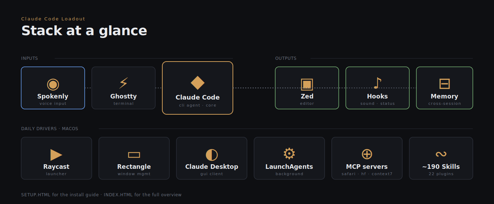

# claude-code-loadout

<p align="center">
  
</p>

My Claude Code setup as a loadout — to look at, copy from, or get inspired by. Sanitized snapshot — no private data, no project names.

## Start Claude Code

```bash
claude --dangerously-skip-permissions
```

Skips every permission prompt for the session. Convenient, but you're trusting Claude with full tool access — only run it in a project where you're fine with that.

> Want the visual setup guide? Open **`setup.html`** in a browser. For the full configuration overview, **`index.html`**.

## What is this?

A coherent setup for **Claude Code** (CLI in Ghostty), including hooks, sound/status feedback, auto-memory, plugins, MCP servers, voice input, and the surrounding stack (terminal, shell, editor, window management).

Not meant as a "best-practice" pamphlet — more a grown constellation that works for me. Adapt what fits, ignore the rest.

## Contents

```
claude-code-loadout/
├── README.md                    # this file
├── setup.html                   # visual setup guide (English, install + workflow)
├── index.html                   # full configuration overview
├── claude/
│   ├── CLAUDE.md                # global instructions as a template (sanitized)
│   ├── settings.json            # permissions, hooks, plugins, marketplaces
│   ├── keybindings.json         # keyboard shortcuts
│   ├── progress-watcher.env.template  # config for the progress watcher
│   ├── commands/
│   │   └── extra.md             # custom /extra slash command
│   ├── hooks/
│   │   ├── notify-stop.sh       # macOS notification on turn end (optional)
│   │   ├── topic-summarize.sh   # chat-wide topic title via Haiku 4.5
│   │   └── inject-eta-reminder.sh  # reminds Claude to set an ETA each turn
│   ├── bin/
│   │   ├── claude-eta           # write per-turn ETA → statusline countdown
│   │   ├── claude-progress      # generic progress feed for the statusline
│   │   ├── claude-progress-watcher  # auto-detect Remotion/ffmpeg/ComfyUI/printers
│   │   └── agent-caffeinate-manager.sh  # keep Mac awake only while Claude works
│   ├── memory/
│   │   ├── MEMORY.md            # index template
│   │   └── *.md                 # example memos (sanitized)
│   └── scripts/
│       ├── play-random-sound.sh
│       ├── flash-screen.sh
│       ├── flash-border-show.sh
│       ├── flash-border-hide.sh
│       ├── flash-border.py
│       └── statusline-command.sh
├── editor/
│   └── zed-settings.json        # pure-black override, SF Mono, telemetry off
├── ghostty/config               # Apple Terminal "Pro" theme
├── shell/
│   ├── zshrc                    # aliases (c/cc/cr), conda, bun
│   └── zprofile                 # brew + DaVinci Resolve scripting env
├── spokenly/
│   └── README.md                # voice-to-text setup, hotkeys, custom vocab
├── launchagents/
│   ├── com.user.claude-progress-watcher.plist  # run the watcher as a background agent
│   └── README.md                # what they do, how to activate
└── apps/
    └── README.md                # daily-driver apps (Raycast, Rectangle, Claude Desktop)
```

## Highlights

- **Sound + visual feedback** after every turn end (configurable hooks)
- **ETA-aware statusline**: every non-trivial turn writes its own time estimate via `claude-eta`, the statusline shows a countdown bar (green → yellow → magenta → red) and switches to overrun mode if the estimate is missed
- **External progress watcher**: `claude-progress-watcher` auto-detects long-running processes (3D-print jobs via OctoPrint/Moonraker, ComfyUI queues, Remotion renders, ffmpeg) and feeds them into the same statusline — no manual wiring
- **Chat-wide topic title**: `topic-summarize.sh` reads the running transcript and updates the tab-title-style label every few prompts, so it tracks the conversation's drift rather than the latest sentence
- **Auto-memory + working-style files** as two layers (short facts per project vs. cross-project patterns)
- **Voice input** via Spokenly (Whisper-based, system-wide) — fastest typing you'll ever do
- **22 active plugins**, ~190 skills in the pool, marketplaces from multiple sources
- **Default workflow rules** in `CLAUDE.md`: branch hygiene, no AI co-author, subagent autopilot pause, ETA per turn
- **LaunchAgent** to run the progress watcher as a background daemon

## Sanitized

What you **won't** find in here:
- personal working-style files (`prompt-style.md`, `tool-usage.md`, `feedback-log.md`, `patterns.md`)
- specific project names
- usernames / emails / GitHub handles
- the actual sound pool path — replaced with a generic `~/Sounds/claude/`
- per-project auto-memories (only templates + sanitized examples)
- transcripts, caches, sessions
- Spokenly custom vocabulary (too project-specific)

## Rebuilding the setup

1. Install **Ghostty**, copy config to `~/.config/ghostty/config`.
2. Install **Claude Code** (`npm i -g @anthropic-ai/claude-code` or via brew).
3. Install **Zed** (`brew install --cask zed`), copy `editor/zed-settings.json` to `~/.config/zed/settings.json`.
4. Install **Spokenly** from the Mac App Store — see `spokenly/README.md` for hotkey + setup.
5. Install **Raycast** and **Rectangle** — details in `apps/README.md`.
6. Copy the contents of `claude/` to `~/.claude/` — then open `settings.json` and check your own paths. The `bin/` scripts need to be executable: `chmod +x ~/.claude/bin/*`.
7. In the sound hook (`scripts/play-random-sound.sh`) adjust the sound pool path, or drop a few `.mp3`s into `~/Sounds/claude/`.
8. Install plugins via Claude Code — the `extraKnownMarketplaces` in `settings.json` lists the sources.
9. For the statusline progress watcher: copy `claude/progress-watcher.env.template` to `~/.claude/progress-watcher.env` and uncomment the detectors you actually use, then optionally load `launchagents/com.user.claude-progress-watcher.plist` (see `launchagents/README.md`).
10. CLI tools you'll want: `gh`, `uv`, `node`, `tmux` (all via Homebrew).

## License

Do whatever you want. No maintenance promises — this is a snapshot, not a maintained library.
